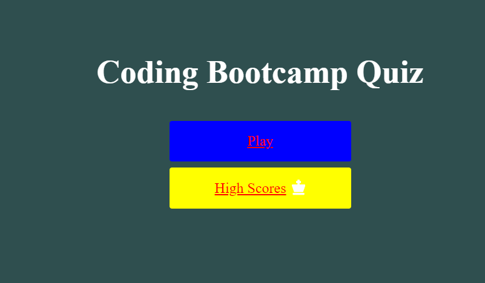

# Code_Quiz.io

This interactive Quiz contains 5 questions with a 30 second timer that records a score based on the time left at the end. A 5 second penalty is introduced when the user gets a question wrong. It also allows the user to add in their high score to be displayed in a separate high score tally. 

Link to Repository: https://github.com/deezyxp/Code_Quiz.io

Link to Live Website: https://deezyxp.github.io/Code_Quiz.io/

Screenshot: 
